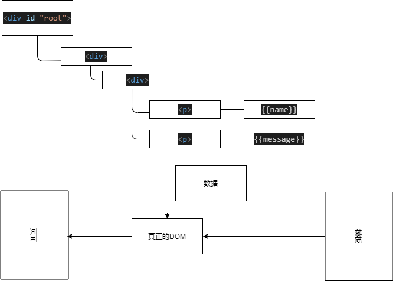

# vue 与模板
 1. 编写页面模板

 # 数据驱动模型
 Vue的执行流程

 1. 获得模板：模板中有“坑”；
 2. 利用vue构造函数中所提供的数据“填坑”，得到可以在页面中显示的“标签”;
 3. 将标签替换页面中原来有“坑”的标签

 Vue 利用提供的数据和页面中模板生成了一个新的HTML标签替换了页面中放置模板的位置。

 自己要怎么实现数据驱动呢?
   

   DOM树分析图：
   

   ## 2. 简单的模板渲染

   ## 3. 虚拟DOM

   1. 怎么将真正的DOM转换为虚拟DOM
   2. 怎么将虚拟DOM转换为真正的DOM

   思路与深拷贝类似：